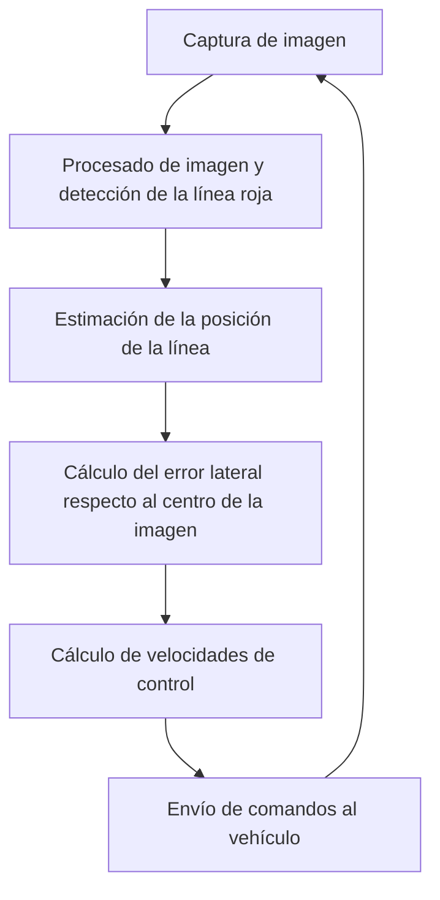
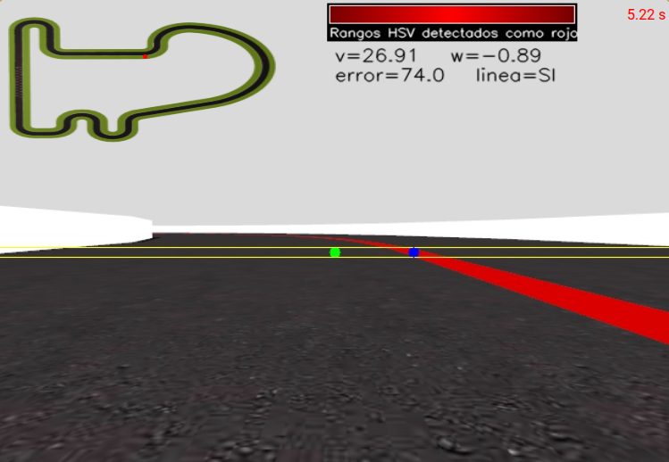
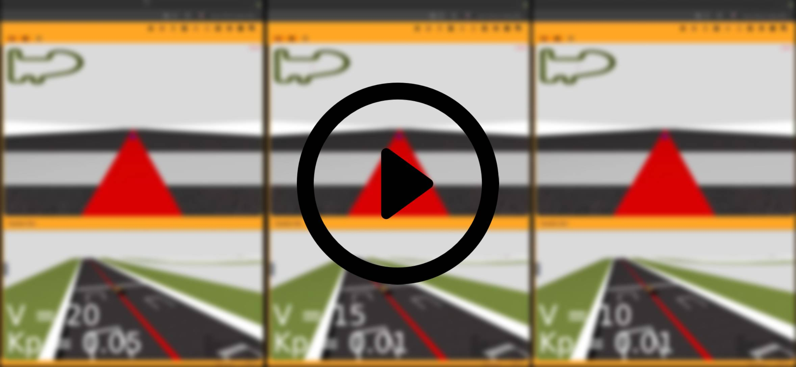

# Seguimiento de línea con control PID

## Unibotics Academy – Follow Line

En este `README.md` narro la solución del problema de __Unibotics__ de __Follow Line__.

El objetivo de este ejercicio es hacer uso de la API hardware simulada mediante la librería de python `HAL` para:
1. Obtener la imagen capturada por el vehículo. (`HAL.getImage()`).
2. Acelerar o desacelerar (`HAL.setV(velocidad_v)`).
3. Girar (`HAL.setW(velocidad_w)`).

Y con esto conseguir que el coche finalice el circuito. Para ello el sistema ademas de la librería `HAL` hace uso de:

* API `GUI`, para mostrar la imagen capturada
* OpenCV, para el procesamiento de la imagen
* Numpy, para los calculos

El desarrollo del controlador se hizo **de forma incremental**, comenzando con un controlador proporcional simple y añadiendo características para mejor el funcionamiento a altas velocidades.

---

# Arquitectura del sistema

El algoritmo se compone de un bucle principal que realiza lo siguiente:

1. Captura la imagen de la cámara
2. Detecta la zona donde se situa la línea roja
3. Calcula el error respecto al centro de la imagen
4. Calcula la velocidad angular y velocidad lineal controladas por el error
5. Envía comandos al vehículo



---

# Detección de la línea roja

Para detectar la línea se procesa **una banda horizontal de la imagen** y se segmenta el color rojo utilizando el espacio de color **HSV** ya que permite separar la iluminación del tono, esto aunque en este entorno digital pueda no ser tan util, mejoraria el rendimiento en un entorno real.

El algoritmo:

1. convierte la imagen a HSV
2. filtra el rojo en dos rangos de tono
3. elimina ruido exigiendo un mínimo de píxeles
4. calcula el **centroide de la línea roja**

Ese centroide representa la **posición del centro de la pista respecto al coche**.



_El punto verde es el centro de la pantalla y el punto azul la detección_

---

# Paso 1 — Control proporcional (P)

El primer controlador implementado fue un **controlador proporcional**.

La velocidad angular se calcula como:

ω = −Kₚ · e

donde:

error = posición_línea - centro_imagen


Interpretación:

* si la línea está a la derecha → girar a la derecha
* si la línea está a la izquierda → girar a la izquierda
* cuanto mayor sea el error → mayor será el giro
* Como de brusco es el giro y como de estable (oscilaciones) es el sistema vendra determinado por el factor Kₚ

---

## Comportamiento del controlador P

Con control proporcional el coche puede seguir la línea **a baja velocidad**.

Resultados experimentales aproximados:

| Velocidad |  Kₚ  | Resultado                                                        |
| --------- | ---- | ---------------------------------------------------------------- |
| 10        | 0.01 | estable                                                          |
| 15        | 0.01 | aceptable                                                        |
| 20        | 0.05 | se sale del circuito \(No se consigue estabilizar con ningún Kₚ) |

---

### Vídeo — Seguimiento estable con P

[](./assets/videos/OnlyP.mp4)

### Añadiendo control de velocidad lineal

Si el error tambien ajusta la velocidad lineal podemos llevar mas al limite el paradigma solo proporcional.

```
error_norm = min(abs(error) / (width / 2), 1.0)

v_lin = V_MAX - (V_MAX - V_MIN) * error_norm
```

Esto nos permite ir un poco mas rápido pero no mejora sustancialmente la solución

[](./assets/videos/OnlyPmasVl.mp4)

---

## Limitación del controlador P

Sin embargo, el controlador proporcional presenta varias limitaciones. Una de las más importantes es que no tiene en cuenta la evolución temporal del error, sino únicamente su valor en el instante actual.

Esto significa que cada frame del sistema de visión se procesa de forma independiente, sin considerar si el error está aumentando o disminuyendo con el tiempo. En situaciones donde el vehículo comienza a oscilar alrededor de la línea, este comportamiento puede amplificar la inestabilidad.

Por ejemplo, si el vehículo atraviesa la línea roja durante un solo frame, el error instantáneo se vuelve cercano a cero. El controlador proporcional interpreta esto como una situación ideal, reduciendo la rotación y permitiendo que la velocidad vuelva a su valor máximo. Sin embargo, el vehículo todavía tiene inercia y continúa desviándose, lo que provoca una corrección tardía y aumenta la oscilación del sistema.

---

# Paso 2 — Añadir el término derivativo

El término derivativo mide **la velocidad de cambio del error**.

D = error - error_{previo}

El controlador pasa a ser:

$$w = K_p error + K_d \frac{d(error)}{dt}$$

## Problemas que resuelve el término derivativo

### 1. Falta de anticipación

El controlador proporcional solo responde cuando el error ya se ha producido. En cambio, el término derivativo permite estimar cómo está cambiando el error, lo que introduce una capacidad de anticipación en el sistema.

### 2. Sobrepaso

Otro problema común del controlador proporcional es el sobrepaso. Debido a la inercia del vehículo y al retardo del sistema de visión, el vehículo suele cruzar la línea central antes de que la corrección tenga efecto. El término derivativo actúa como un amortiguador, reduciendo la magnitud de las oscilaciones.

### 3. Sensibilidad al retardo del sistema

De la misma naera que la derivada gestiona el sobrepaso, al estudiar la tendencia, ayuda a la sensibilidad al retardo del sistema.

---
### Vídeo — Seguimiento estable con PD

[](./assets/videos/OnlyPD.mp4)

---

# Paso 3 — Cuándo tiene sentido la integral

El término integral acumula el error en el tiempo:

$$I = \int error , dt$$

Esto sirve para eliminar **errores persistentes**. Como por ejemplo esa desviación a la derecha o izquierda que tiene en las lineas rectas.
