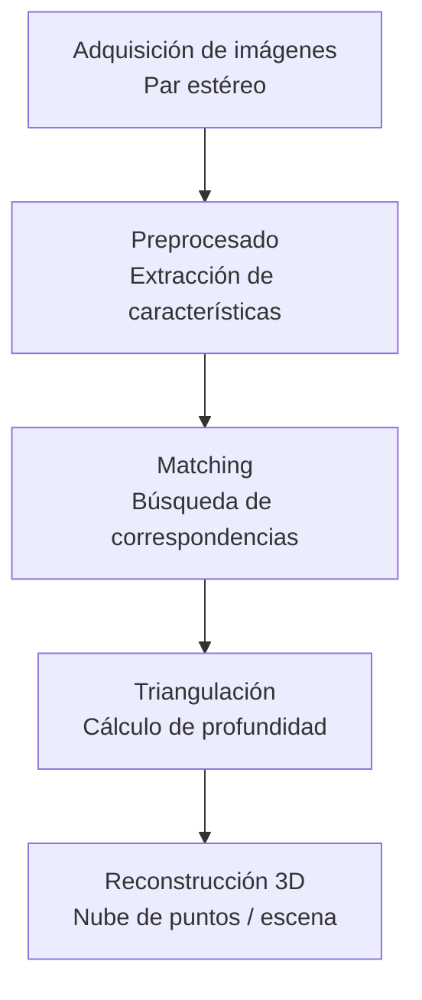

# Reconstrucción 3D con par estéreo

## Unibotics Academy – 3D Reconstruction

El objetivo de esta practica es reconstruir una escena tridimensional a partir de un par estereo, (una camara derecha e izquierda). Esto es posible gracias a que cuando dos camaras capturan una misma escena, existe una relación geométrica entre ellas. Esta relación es la geometría epipolar. 

De esto lo mas importante es la relacion que hay entre dos puntos en el espacio imagen que representan un punto de la escena 3D. Gracias a esta teoría podemos explotar esta relación mediante el par estereo, para obligar por diseño, a que un punto de la imagen derecha y un punto en la imagen izquierda, que representan el mismo punto en el espacio 3D, caigan en la misma coordenada y.

Y esto nos permite reducir el espacio de posiblidades para machear los puntos de interes que consideremos entre las dos imagenes. Con estos puntos, y gracias a variables conocidas de nuestro par estereo, como los intrinsecos de las camaras y la distancia entre ellas, podemos triangular la distancia de las camaras al punto en la escena 3D y usar suficientes puntos como para reconstruir por tanto la escena. 

Por tanto el pipeline que debemos seguir sería algo asi:

### Adquisición, preprocesado y extracción de características

Para la extracción de puntos de interes que nos serviran para la reconstrucción usaremos el descriptor de Canny, esto nos hara focalizarnos en los bordes de los objetos que son puntos de alta frecuencia que facilitarán el match. 

Los puntos de interes son cada pixel que no sea 0.

### Matching (Búsqueda de correspondencias)

Para encontrar las correspondencias entre pixeles, recorremos punto a punto de interes de la imagen izquierda y cogemos de ese punto un parche horizontal. Al ser vordes, estas diferencias de intensidades y colores deberia ser suficiente para encontrar el match. Para encontrar el punto homólogo, se compara el parche izquierdo con todos los parches candidatos dentro de una franja horizontal de la imagen derecha utilizando `matchTemplate`, que implementa un filtro de correlación. La posición con menor error se selecciona como la mejor correspondencia.

Algunos ejemplos:

Muchos maches

Para dar un match por bueno tiene que superar un umbral y una disparidad, estos datos son cambiables en el codigo. Ademas por tema de recursos se define un step de muestreo de los puntos en el eje x para que solo se triangulen 1 de cada x puntos. 

### Triangulación 

Una vez obtenidos los matches procedemos a triangular, para ello pasamos los puntos a coordenadas del mundo añadiendo una dimensión mas, de esta forma podremos operar. Esto nos permite mediante las funciones de unibotics genarar una recta en el espacio de la camara derecha y otra de la camara izquierda. 

En un mundo ideal estas recatas se cortarían en un punto en el espacio 3D pero debido al ruido esto no sucede. Es por eso que para poder obtener el punto de interseccion obtenemos el punto de minima distancia entre ambas rectas. 

### Visualización

Para visualizar los puntos usamos las funciones de la libreria de WebGui. El problema que tenia yo con mi ordenador es que se me ralentizaba, por lo que monte una carpeta en docker para guardar un ply, y abrirlo después en cloud compare. 

Lo que mejor se ve es el pato y la caja de cereales, salen pocos puntos debidos a restricciones en lo que se considera un match. Estas pueden modificarse en el codigo.

Seleccionando todos los puntos del filtro de canny:

Se pueden ver las distintas profundidades de perfil:

