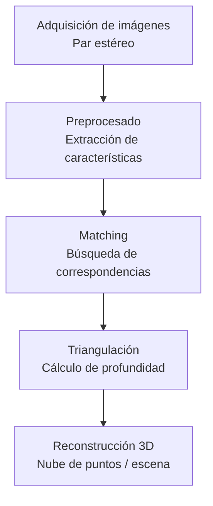
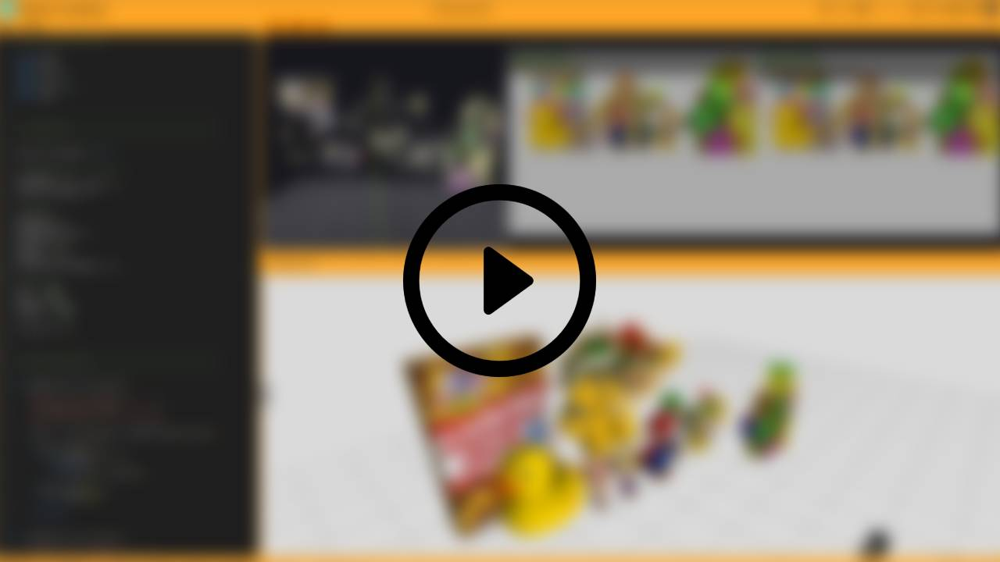

# Reconstrucción 3D con par estéreo

## Unibotics Academy – 3D Reconstruction

El objetivo de esta practica es reconstruir una escena tridimensional a partir de un par estereo, (una camara derecha e izquierda). Esto es posible gracias a que cuando dos camaras capturan una misma escena, existe una relación geométrica entre ellas. Esta relación es la geometría epipolar. 


De esto lo mas importante es la relacion que hay entre dos puntos en el espacio imagen que representan un punto de la escena 3D. Gracias a esta teoría podemos explotar esta relación mediante el par estereo, para obligar por diseño, a que un punto de la imagen derecha y un punto en la imagen izquierda, que representan el mismo punto en el espacio 3D, caigan en la misma coordenada y.


Y esto nos permite reducir el espacio de posiblidades para machear los puntos de interes que consideremos entre las dos imagenes. Con estos puntos, y gracias a variables conocidas de nuestro par estereo, como los intrinsecos de las camaras y la distancia entre ellas, podemos triangular la distancia de las camaras al punto en la escena 3D y usar suficientes puntos como para reconstruir por tanto la escena. 


Por tanto el pipeline que debemos seguir sería algo asi:


```mermaid
flowchart TD
    A[Adquisición de imágenes<br/>Par estéreo] --> B[Preprocesado<br/>Extracción de características]
    B --> C[Matching<br/>Búsqueda de correspondencias]
    C --> D[Triangulación<br/>Cálculo de profundidad]
    D --> E[Reconstrucción 3D<br/>Nube de puntos / escena]
```

### Adquisición, preprocesado y extracción de características

Para la extracción de puntos de interes que nos serviran para la reconstrucción usaremos el descriptor de Canny, esto nos hara focalizarnos en los bordes de los objetos que son puntos de alta frecuencia que facilitarán el match. 


Los puntos de interes son cada pixel que no sea 0.

### Matching (Búsqueda de correspondencias)

Para encontrar las correspondencias entre pixeles, recorremos punto a punto de interes de la imagen izquierda y cogemos de ese punto un parche horizontal. Al ser vordes, estas diferencias de intensidades y colores deberia ser suficiente para encontrar el match. Para encontrar el punto homólogo, se compara el parche izquierdo con todos los parches candidatos dentro de una franja horizontal de la imagen derecha utilizando `matchTemplate`, que implementa un filtro de correlación. La posición con menor error se selecciona como la mejor correspondencia.

Algunos ejemplos:


Muchos maches


Para dar un match por bueno tiene que superar un umbral y una disparidad, estos datos son cambiables en el codigo. Ademas por tema de recursos se define un step de muestreo de los puntos en el eje x para que solo se triangulen 1 de cada x puntos. 

### Triangulación 

Una vez obtenidos los matches procedemos a triangular, para ello pasamos los puntos a coordenadas del mundo añadiendo una dimensión mas, de esta forma podremos operar. Esto nos permite mediante las funciones de unibotics genarar una recta en el espacio de la camara derecha y otra de la camara izquierda. 


En un mundo ideal estas recatas se cortarían en un punto en el espacio 3D pero debido al ruido esto no sucede. Es por eso que para poder obtener el punto de interseccion obtenemos el punto de minima distancia entre ambas rectas. 

### Visualización

Para visualizar los puntos usamos las funciones de la libreria de WebGui. El problema que tenia yo con mi ordenador es que se me ralentizaba, por lo que monte una carpeta en docker para guardar un ply, y abrirlo después en cloud compare. 


Lo que mejor se ve es el pato y la caja de cereales, salen pocos puntos debidos a restricciones en lo que se considera un match. Estas pueden modificarse en el codigo.

Seleccionando todos los puntos del filtro de canny:


Se pueden ver las distintas profundidades de perfil:


# Corrección práctica

En esta última versión de la práctica he corregido los principales problemas detectados en la entrega anterior. La versión inicial funcionaba únicamente bajo una hipótesis demasiado fuerte: que el par estéreo estaba rectificado y que, por tanto, el punto homólogo de la imagen derecha se encontraba en la misma coordenada `y` que el punto de la imagen izquierda. Esto simplificaba mucho el matching, pero hacía que el algoritmo no fuese válido para un par estéreo general.

Además, la reconstrucción 3D obtenida era bastante pobre porque el emparejamiento generaba muchos falsos positivos y la triangulación dependía demasiado de esa búsqueda horizontal. Por eso, en esta corrección he cambiado el enfoque para que el algoritmo use la geometría real de las cámaras y no una rectificación asumida.

## Corrección 1: uso de epipolares reales

La modificación más importante es que ahora la búsqueda del punto correspondiente en la imagen derecha no se hace sobre una línea horizontal fija, sino sobre la línea epipolar real asociada a cada punto de la imagen izquierda.

Para cada punto detectado en la imagen izquierda se realiza el siguiente proceso:

1. Se pasa el punto de coordenadas gráficas a coordenadas ópticas mediante `HAL.graficToOptical`.
2. Se retroproyecta el punto con `HAL.backproject`, obteniendo un punto 3D situado sobre el rayo de visión de la cámara izquierda.
3. Se obtiene la posición de la cámara izquierda con `HAL.getCameraPosition`.
4. Con la posición de la cámara y el punto retroproyectado se construye el rayo 3D correspondiente al píxel izquierdo.
5. Se toman dos puntos diferentes sobre ese mismo rayo.
6. Esos dos puntos se proyectan sobre la cámara derecha usando `HAL.project`.
7. Los dos puntos proyectados definen la recta epipolar en la imagen derecha.

De esta forma, la búsqueda ya no depende de que el par estéreo esté rectificado. Si las cámaras tienen otra orientación relativa, la epipolar podrá estar inclinada, vertical o desplazada, y el algoritmo seguirá buscando en la zona geométricamente correcta.

En el código esta parte queda concentrada en la función `calcular_epipolar_derecha`, que devuelve los candidatos de búsqueda en la imagen derecha, los extremos visibles de la recta epipolar y los puntos proyectados usados para construirla.

## Corrección 2: matching sobre una banda epipolar

En la versión anterior, para cada punto de la imagen izquierda se buscaba el match únicamente en una franja horizontal de la imagen derecha. Esta aproximación solo era válida si ambas imágenes estaban perfectamente rectificadas.

Ahora, una vez calculada la epipolar real, se genera una pequeña banda alrededor de ella. El parámetro `BAND_RADIUS` controla el grosor de esa banda. Esto permite que la búsqueda sea más robusta frente a pequeños errores numéricos, ruido o discretización de píxeles.

El matching se realiza comparando parches de la imagen izquierda y derecha con `cv2.matchTemplate`, usando correlación normalizada. En esta versión se ha aumentado el tamaño del parche a `PATCH_SIZE = 15`, lo que ayuda a que cada comparación tenga más contexto visual y reduzca matches ambiguos.

También se han añadido filtros adicionales:

- `MIN_SCORE = 0.90`, para aceptar solo correspondencias con alta correlación.
- `MIN_DISP = 2.0`, para evitar triangulaciones inestables con desplazamientos casi nulos.
- `MAX_DISP = 250.0`, para descartar correspondencias demasiado alejadas que probablemente sean erróneas.
- `MAX_MATCHES_TO_TRIANGULATE = 50`, para triangular solo los mejores matches y mantener el sistema en tiempo real.

Otra corrección importante es que ahora los matches se ordenan de mejor a peor score. En versiones anteriores se podían estar priorizando puntos peores, lo que metía ruido en la nube final.

## Corrección 3: triangulación lanzando rayos

La triangulación también se ha corregido para que se haga lanzando rayos desde ambas cámaras.

Para cada match válido:

1. Se convierte el punto izquierdo y derecho de coordenadas gráficas a coordenadas ópticas.
2. Se retroproyecta cada punto con `HAL.backproject`.
3. Se obtiene la posición 3D de la cámara izquierda y de la cámara derecha.
4. Se construye un rayo desde cada cámara hasta su punto retroproyectado.
5. Se calcula la mínima distancia entre los dos rayos.
6. Como en la práctica real los rayos no se cortan exactamente por ruido y errores de matching, se toma como punto reconstruido el punto medio entre ambos rayos en la zona de mínima distancia.

Esto es más correcto geométricamente que intentar obtener la profundidad solo a partir de una disparidad horizontal, ya que ahora la reconstrucción depende de las rectas 3D generadas por las cámaras y no de una simplificación válida solo para estéreo rectificado.

También se ha corregido el desplazamiento de la nube 3D. En la versión final, el punto reconstruido se calcula sumando la posición de la cámara izquierda:

```python
point_3d = p1 + (m * d1) + ((c / 2) * n)
```

Esta suma es importante porque el punto debe quedar expresado en el sistema de coordenadas global de la escena. Sin ella, la nube podía aparecer desplazada respecto al origen correcto.

## Corrección 4: filtrado de puntos 3D

Para mejorar la calidad de la reconstrucción se han añadido filtros sobre la nube resultante. Aunque el matching sea más restrictivo, algunos emparejamientos incorrectos pueden seguir produciendo puntos 3D muy alejados o incoherentes.

Por eso se descartan puntos que no sean finitos o que se salgan de unos límites razonables:

```python
MIN_Z = -10000
MAX_Z = 10000
MAX_ABS_X = 10000
MAX_ABS_Y = 10000
```

Estos límites permiten eliminar outliers extremos sin modificar el funcionamiento principal del algoritmo. En caso de cambiar la escena o la escala del simulador, estos valores se pueden ajustar fácilmente.

## Corrección 5: mejora de la visualización y depuración

La visualización también se ha modificado para que sea más clara durante la ejecución.

Ahora se muestran:

- Los puntos candidatos detectados con Canny.
- Algunas líneas epipolares reales en la imagen derecha.
- Los puntos proyectados que se usan para construir dichas epipolares.
- Los matches aceptados, dibujados con colores consistentes en ambas imágenes.
- Contadores de puntos usados, epipolares calculadas, matches aceptados y errores.

Además, las imágenes de depuración se oscurecen ligeramente para que las líneas, puntos y textos se vean mejor. Esto solo afecta a la visualización, no al matching ni a la triangulación.

También se mantiene el modo:

```python
DEBUG_SOLO_EPIPOLARES = False
```

Si se activa, permite visualizar únicamente las epipolares sin hacer matching ni triangulación. Esto es útil para comprobar que la geometría epipolar se está calculando correctamente antes de reconstruir la escena.

## Resultado final

[](./assets/resultado.mp4)
