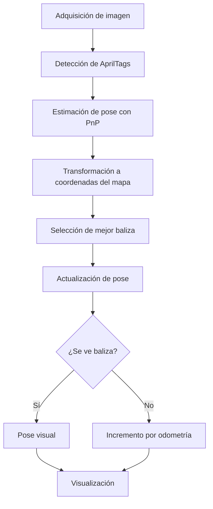

# Autolocalización de un robot mediante AprilTags y odometría

## Unibotics Academy – Marker Based Visual Loc

El objetivo de esta práctica es desarrollar un sistema de autolocalización para un robot móvil en un entorno doméstico mediante el uso de visión artificial y odometría. En concreto, el robot debe ser capaz de estimar su posición y orientación en el mapa utilizando balizas visuales (AprilTags) distribuidas por el entorno.

El escenario de trabajo consiste en un entorno cerrado en el que se han colocado múltiples marcadores AprilTag en posiciones conocidas. Cada baliza dispone de una pose absoluta definida en un mapa (posición y orientación), lo que permite utilizarla como referencia para la localización del robot. Durante la ejecución, el robot navega de manera autónoma por el entorno mientras captura imágenes con su cámara y detecta dichas balizas cuando entran en su campo de visión.

El robot dispone de un sensor láser (LIDAR), que se emplea para la navegación autónoma dentro del entorno. A través de la API proporcionada, se obtienen medidas de distancia en un rango angular de 180 grados, lo que permite implementar un comportamiento reactivo de exploración basado en la evitación de obstáculos.

A continuación, se explica el proceso de detección de balizas AprilTag y el modelo de cámara utilizado. Posteriormente, se desarrolla el método de estimación de pose mediante PnP y su transformación a coordenadas globales del mapa. Finalmente, se describe la integración con la odometría y el criterio seguido para seleccionar la mejor estimación de la posición del robot en cada instante. 

## Pipeline de procesamiento

## Detección de AprilTags

La detección de balizas visuales se realiza mediante el uso de la librería `pyapriltags`, siguiendo el procedimiento descrito en la documentación de la práctica. Esta herramienta permite identificar de forma robusta marcadores AprilTag en las imágenes capturadas por la cámara del robot.

El proceso comienza con la adquisición de una imagen del entorno, que posteriormente se transforma a escala de grises para facilitar la detección. A partir de esta imagen, el detector analiza posibles regiones candidatas y decodifica los patrones binarios característicos de los AprilTags.

Como resultado, se obtiene un conjunto de detecciones, cada una de las cuales contiene información relevante del marcador identificado. En particular, se dispone de:

- Un identificador único del marcador, que permite asociarlo con su posición conocida en el mapa.
- Las coordenadas en imagen de las cuatro esquinas del tag.
- La posición del centro del marcador en la imagen.

El módulo de detección se basa directamente en la implementación proporcionada en la [documentación de la práctica](https://jderobot.github.io/RoboticsAcademy/exercises/ComputerVision/marker_visual_loc), integrándose como parte del sistema completo de autolocalización del robot.

## Estimación de pose a partir de una baliza

En esta sección se describe el proceso completo mediante el cual se estima la posición y orientación del robot a partir de la detección de una única baliza AprilTag. Este proceso constituye el núcleo del sistema de autolocalización, ya que permite obtener una estimación absoluta de la pose del robot en el mapa.

El método seguido puede dividirse en varias etapas: obtención de correspondencias 2D-3D, resolución del problema PnP, transformación entre sistemas de referencia y proyección al plano global.

### Modelo de cámara e intrínsecos

Para poder relacionar puntos del espacio 3D con sus proyecciones en la imagen, es necesario disponer de un modelo de cámara. En este caso, se utiliza el modelo de cámara pinhole, que describe el proceso de formación de la imagen mediante una proyección perspectiva.

Este modelo se define a través de la matriz de parámetros intrínsecos, que contiene la información necesaria para transformar coordenadas en el sistema de la cámara a coordenadas en el plano imagen. En particular, incluye:

- La distancia focal de la cámara.
- La posición del centro óptico en la imagen.

Además, se asume que la cámara no presenta distorsión, lo que simplifica el modelo y permite trabajar directamente con una proyección ideal.

### Correspondencias entre puntos 2D y 3D

Para poder estimar la pose relativa entre la cámara y la baliza, es necesario establecer correspondencias entre puntos del mundo real y su proyección en la imagen.

En este caso, se utilizan las cuatro esquinas del marcador AprilTag:

- En el espacio 3D, las esquinas del marcador se definen en su sistema de referencia local, considerando el tamaño real del tag.
- En la imagen, se emplean las coordenadas 2D de dichas esquinas detectadas previamente.

Estas correspondencias permiten formular el problema de estimación de pose como un problema clásico de geometría proyectiva.

Para obtener las correspondencias correctamente, hay que visualizar el orden en el que obtnemos las esquinas.

### Estimación de la pose relativa mediante PnP

Una vez establecidas las correspondencias entre los puntos 3D del marcador y sus proyecciones en la imagen, se procede a resolver el problema Perspective-n-Point (PnP). Este problema permite estimar la relación espacial entre la cámara y la baliza a partir de la geometría proyectiva y de los parámetros intrínsecos de la cámara.

La solución obtenida describe cómo se encuentra el marcador respecto a la cámara, es decir, proporciona tanto su orientación como su posición relativa. Esta información se representa mediante una transformación rígida compuesta por una matriz de rotación y un vector de traslación, que juntos definen completamente la pose del marcador en el sistema de referencia de la cámara.

### Transformación al sistema de referencia del marcador

Para el problema de autolocalización no interesa conocer la posición del marcador respecto a la cámara, sino justo lo contrario: la posición de la cámara respecto al marcador. Por este motivo, es necesario invertir la transformación obtenida.

Si la transformación original viene dada por:

Su inversa puede calcularse como:

Al invertir la transformación, la cámara pasa a expresarse en el sistema de referencia del tag detectado. Esto permite interpretar directamente la posición relativa del robot respecto a la baliza, lo cual resulta clave para poder integrar esta información con el mapa del entorno.

### Proyección de la pose al sistema global del mapa

Una vez obtenida la posición de la cámara en el sistema de referencia del marcador, el siguiente paso consiste en transformarla al sistema global del mapa. Para ello, se utiliza la información conocida de cada baliza, que incluye su posición y orientación en el entorno.

Cada marcador define implícitamente un sistema de referencia local sobre el plano. A partir de su orientación en el mapa, es posible construir dos direcciones fundamentales: una dirección normal, perpendicular al plano del marcador, que indica hacia dónde “mira” la baliza, y una dirección tangente, contenida en el plano, que define el eje lateral.

A partir de estas direcciones, la posición relativa de la cámara respecto al tag puede proyectarse en el plano global combinando la distancia frontal y el desplazamiento lateral. De forma simplificada, la posición del robot en el mapa puede expresarse como:

De este modo, se obtiene directamente la posición del robot en coordenadas globales.

### Estimación de la orientación global

Además de la posición, es necesario estimar la orientación del robot en el plano. Para ello, se utiliza la matriz de rotación obtenida tras invertir la transformación.

A partir de esta matriz, se extrae el eje frontal de la cámara expresado en el sistema de referencia del marcador. Este vector permite calcular el ángulo relativo en el plano, que posteriormente se combina con la orientación absoluta del tag en el mapa.

De forma simplificada, la orientación global del robot puede expresarse como:

### Selección de la mejor estimación

En situaciones en las que se detectan múltiples balizas simultáneamente, es posible obtener varias estimaciones de la pose del robot. Sin embargo, estas estimaciones no tienen la misma precisión.

Para mejorar la robustez del sistema, se selecciona la estimación asociada a la baliza más cercana al robot. Esto se debe a que la estimación obtenida mediante PnP es más fiable cuando el marcador ocupa una mayor región en la imagen, lo que reduce el efecto del ruido en la detección. Esto se puede ver en el resultado de la siguiente sección.

De este modo, se garantiza que en cada instante se utiliza la estimación más precisa disponible.

## Resultado sin odometría

En este primer resultado, en el que no se emplea odometría, se observa que el sistema es capaz de estimar correctamente la posición del robot cuando las balizas son visibles y ocupan una región suficientemente grande en la imagen. Sin embargo, cuando el marcador aparece a mayor distancia, su tamaño en la imagen disminuye y la estimación obtenida mediante PnP se vuelve más inestable. Además, en los instantes en los que no se detecta ninguna baliza, la estimación de la pose queda completamente congelada en la última posición válida, ya que no se dispone de ningún mecanismo alternativo para actualizarla. 

## Resultado con odometría

Para solventar esta limitación, se ha incorporado la odometría del robot como mecanismo de estimación incremental. En este enfoque, cuando no se detectan balizas, la posición del robot se actualiza a partir del desplazamiento estimado entre instantes consecutivos, utilizando únicamente incrementos de movimiento y no la posición absoluta proporcionada por la odometría. De este modo, se consigue mantener una estimación continua de la pose incluso en ausencia de referencias visuales. Aunque la odometría introduce errores acumulativos debido al ruido, estos se corrigen cada vez que el robot vuelve a detectar una baliza, combinando así la estabilidad de la predicción con la precisión de la medida visual.
