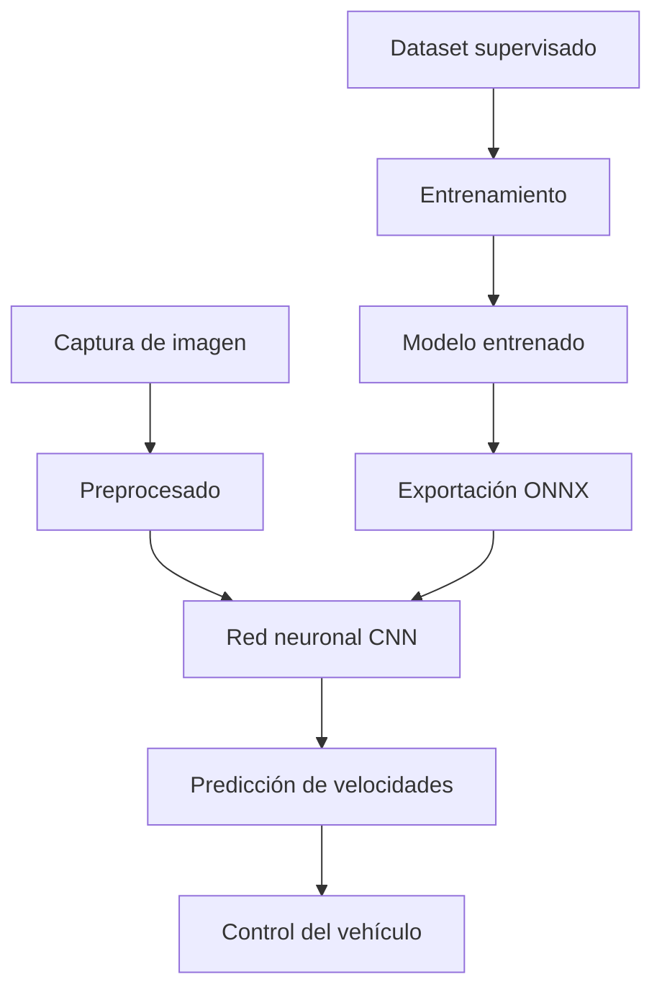

# End-to-End Visual Control mediante Deep Learning

## Unibotics Academy – Fórmula 1 autónomo con visión artificial

El objetivo de esta práctica es desarrollar un sistema de conducción autónoma basado en Deep Learning para un vehículo de Fórmula 1 simulado. El coche dispone únicamente de una cámara frontal como sensor principal y debe ser capaz de recorrer distintos circuitos siguiendo una línea roja situada en el centro de la pista.

A diferencia de aproximaciones clásicas basadas en visión artificial y control explícito, en esta práctica se emplea una arquitectura de aprendizaje extremo a extremo (*end-to-end learning*). En este enfoque, la red neuronal aprende directamente la relación entre las imágenes capturadas por la cámara y las acciones de control necesarias para conducir el vehículo.

La tarea consiste en entrenar un modelo neuronal supervisado utilizando ejemplos obtenidos a partir de un conductor experto. Durante la fase de entrenamiento, el modelo aprende a asociar cada imagen de entrada con las velocidades lineal y angular adecuadas para mantener el vehículo centrado sobre la línea.

Posteriormente, el modelo entrenado se utiliza en inferencia en tiempo real dentro del simulador, generando directamente las órdenes de control del vehículo a partir de las imágenes capturadas por la cámara.

---

# Pipeline general del sistema

---

# Dataset supervisado

El entrenamiento del sistema se basa en un dataset de imagenes con sus respectivas veolcidades lineal y angular, una muestra del daset contiene por tanto:

- Una imagen capturada desde la cámara frontal del vehículo.
- La velocidad lineal aplicada por el conductor experto.
- La velocidad angular aplicada en ese instante.

El conjunto de datos utilizado incluye múltiples circuitos y situaciones de conducción, permitiendo entrenar un modelo con capacidad de generalización sobre distintos escenarios.

Las imágenes representan diferentes tipos de situaciones:

- Tramos rectos.
- Curvas suaves.
- Curvas pronunciadas.
- Cambios rápidos de dirección.
- Variaciones de iluminación y perspectiva.

El objetivo del modelo es aprender implícitamente la geometría de la pista y generar las acciones de control apropiadas únicamente a partir de la información visual.

Muestra del `.csv`

| image | v | w |
|---|---|---|
| images_part_01/image_1.png | 4.0 | -0.7414299999999976 |
|images_part_01/image_2.png	|5.626 |-0.281629999999998 |
|images_part_01/image_3.png	|5.734 |-0.1309399999999979 |
|images_part_01/image_4.png	|6.0|-0.1659399999999994 |
|images_part_01/image_5.png	|5.8|-0.2153199999999991 |
|images_part_01/image_6.png	|6.2940000000000005|-0.1102899999999977 |
|images_part_01/image_7.png	|5,974|-0.1212399999999999 |
|images_part_01/image_8.png	|4.0	|-0.2709299999999999 |
|images_part_01/image_9.png	|4.0	|-0.6775499999999981 |
|images_part_01/image_10.png	|4.0	|-0.2442899999999998 |
|images_part_01/image_11.png	|4.0	|-0.3047300000000004 |
|images_part_01/image_12.png	|4.0	|-0.730689999999999 |
|images_part_01/image_13.png	|4.0	|-0.2175300000000004 |
|images_part_01/image_14.png	|4.0	|-0.2024399999999983 |

---

# Preprocesado de imágenes

Antes de entrenar la red neuronal, las imágenes del dataset se someten a una fase de preprocesado para mejorar la estabilidad del aprendizaje y reducir información irrelevante.

## Recorte de la imagen

La parte superior de las imágenes contiene principalmente información del horizonte y del entorno lejano, que aporta poca utilidad para la conducción reactiva. Por este motivo, se realiza un recorte vertical para centrar la atención del modelo en la región inferior de la imagen, donde aparece la línea roja y la geometría inmediata de la pista.

Este recorte permite reducir la complejidad de entrada y facilita que la red aprenda patrones relevantes.

---

## Redimensionado

Todas las imágenes se transforman a una resolución fija antes de ser introducidas en la red neuronal. Esto garantiza consistencia en el tamaño de entrada y reduce el coste computacional durante el entrenamiento e inferencia.

---

## Normalización

Los valores de intensidad de la imagen se normalizan para mejorar la estabilidad numérica del entrenamiento. Este proceso evita diferencias excesivas de escala entre canales y acelera la convergencia del modelo.

---

## Aumento de datos

Para mejorar la robustez y capacidad de generalización, se aplican técnicas de *data augmentation* sobre las imágenes del entrenamiento.

Entre las transformaciones utilizadas se encuentran:

- Volteo horizontal aleatorio de la imagen.
- Inversión del signo de la velocidad angular `w` cuando se aplica ese volteo horizontal.
- Variaciones aleatorias de brillo.
- Variaciones aleatorias de contraste.
- Desenfoque gaussiano ocasional.

Estas modificaciones generan ejemplos más variados y ayudan a reducir el sobreajuste.

---

# Arquitectura neuronal

Para resolver el problema se ha utilizado una arquitectura convolucional inspirada en PilotNet, una red neuronal propuesta originalmente por NVIDIA para conducción autónoma.

Nuestra red tiene 5 capas convolucionales dando como resultado despues de la capa `Flatten` un vector de dimension 1152 

ç

Las primeras capas convolucionales aprenden filtros capaces de detectar patrones visuales simples, como bordes o líneas. Conforme aumenta la profundidad de la red, las representaciones internas se vuelven más abstractas y permiten identificar estructuras más complejas relacionadas con la geometría de la pista.

La reducción progresiva de resolución permite condensar la información visual más relevante manteniendo únicamente las características necesarias para la conducción.

Luego este vector lo conectamos a un MLP con 3 capas ocultas de 100, 50 y 10 neuronas. Con una capa de salida de 2, velocidad lineal, y angular.

Se trata de un problema de regresión continua, ya que el modelo debe predecir valores reales y no categorías discretas.

---

# Entrenamiento del modelo

El entrenamiento se llevó a cabo utilizando GPU, lo que permitió acelerar considerablemente el proceso. Se configuró un máximo de 12 épocas y un tamaño de batch de 128 muestras.

Para el aprendizaje del modelo se utilizó una función de pérdida de regresión basada en el error cuadrático medio (*Mean Squared Error*, MSE). Esta función mide la diferencia entre las velocidades predichas por la red neuronal y las velocidades reales registradas en el dataset del conductor experto.

El uso de MSE resulta adecuado en este problema debido a que las salidas del modelo son variables continuas, concretamente la velocidad lineal y la velocidad angular del vehículo. Penalizar cuadráticamente los errores permite dar mayor importancia a predicciones incorrectas de gran magnitud, favoreciendo una conducción más precisa y estable.

Durante el entrenamiento se monitorizaron tanto la pérdida en entrenamiento como la pérdida en validación. El mejor resultado se obtuvo en la época 3, con una pérdida de validación de 0.0948.

A partir de ese punto, aunque la pérdida de entrenamiento continuó disminuyendo, la validación no mejoró de forma estable, lo que indica el inicio de cierto sobreajuste.

Por este motivo, el entrenamiento se detuvo automáticamente mediante *early stopping* en la época 8, conservando el mejor modelo encontrado durante el proceso.

La Figura anterior muestra la evolución de la pérdida durante el entrenamiento y validación del modelo. Se observa cómo ambas curvas disminuyen inicialmente, indicando que la red aprende correctamente las relaciones entre imágenes y comandos de control. Sin embargo, a partir de aproximadamente la época 3, la pérdida de validación deja de mejorar de manera consistente mientras la pérdida de entrenamiento continúa descendiendo, evidenciando un comienzo de sobreajuste.

---

# Exportación a ONNX

Una vez finalizado el entrenamiento, el modelo se exportó al formato ONNX (*Open Neural Network Exchange*), que es el formato soportado por RoboticsAcademy para ejecutar inferencia dentro del simulador.

La exportación permite desacoplar el modelo del framework original de entrenamiento y facilita su ejecución optimizada mediante ONNX Runtime y aceleración GPU.

---

# Integración del modelo en Unibotics

# Integración del modelo en Unibotics

Una vez entrenado y exportado el modelo a formato ONNX, se integró en el entorno de Unibotics para realizar inferencia en tiempo real. El sistema funciona de forma reactiva: en cada iteración se obtiene una imagen de la cámara frontal del vehículo, se aplica el mismo preprocesado utilizado durante el entrenamiento y se ejecuta el modelo neuronal para obtener las velocidades de control.

El modelo predice directamente dos valores continuos: la velocidad lineal del coche y la velocidad angular. Estos valores se envían posteriormente a los actuadores del vehículo mediante la API de Unibotics.

Antes de aplicar las velocidades al vehículo, las predicciones de la red se saturan para garantizar que permanezcan dentro de los límites físicos permitidos:

donde  limita los valores al rango permitido.

Posteriormente, para mejorar la estabilidad de la conducción, se aplicó un suavizado temporal sobre las predicciones del modelo mediante un filtrado exponencial:

Este filtrado reduce cambios bruscos entre iteraciones consecutivas y permite obtener una trayectoria más fluida, disminuyendo las oscilaciones del coche alrededor de la línea roja.

---

# Resultados obtenidos

El modelo fue evaluado en varios circuitos del entorno de Unibotics, con el objetivo de comprobar tanto su rendimiento como su capacidad de generalización.

| Circuito | Resultado |
|---|---|
| Simple Circuit | Completado en 100 s |
| Montreal | Completado en 4 min 53 s |
| Montmeló | No completado (Curva muy pronunciada) |
| Nürburgring | No completado (Por error del simulador) |

En el circuito simple, el coche fue capaz de completar una vuelta completa de forma estable, siguiendo correctamente la línea roja. Este resultado confirma que el modelo aprendió satisfactoriamente el comportamiento básico de seguimiento de línea.

En el circuito de Montreal, el modelo también consiguió completar una vuelta completa.

En el circuito de Montmeló, el coche falló en la curva más pronunciada. En esta situación, la red no generó una velocidad angular suficiente para corregir la trayectoria, provocando que el vehículo se alejara de la línea y terminara golpeándose.

En Nürburgring, el modelo falló al inicio del circuito. Parece ser que hay un problema con el circuito o el simulador ya que si se obvia toda la red y se pone manualmente la velocidad angular a 0 y la velocidad lineal a un valor constante aun asi el coche gira y se estrella.

---

# Conclusiones

La práctica demuestra que es posible controlar un vehículo autónomo mediante una aproximación extremo a extremo basada únicamente en imágenes de cámara. El modelo entrenado fue capaz de completar satisfactoriamente el circuito simple y el circuito de Montreal, generando directamente las velocidades lineal y angular necesarias para conducir el coche.

No obstante, el fallo observado en Montmeló muestra que la robustez del sistema depende en gran medida de la calidad y diversidad del dataset. Para mejorar los resultados sería conveniente incorporar más ejemplos de curvas pronunciadas, situaciones de recuperación y escenarios en los que el coche se encuentra parcialmente desviado de la línea.

---

# Referencias

- NVIDIA Developer Blog. *Explaining How End-to-End Deep Learning Steers a Self-Driving Car*. Disponible en: https://developer.nvidia.com/blog/explaining-deep-learning-self-driving-car/

- Bojarski, M. et al. *End to End Learning for Self-Driving Cars*. NVIDIA. Disponible en: https://arxiv.org/abs/1604.07316

- The NVIDIA PilotNet Experiments. Disponible en: https://arxiv.org/pdf/2010.08776

- RoboticsAcademy. *End to End Visual Control Exercise Documentation*. Disponible en: https://jderobot.github.io/RoboticsAcademy/exercises/AutonomousCars/follow_line_dl